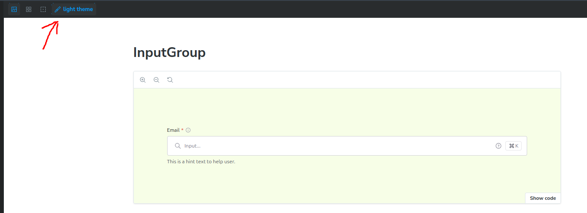
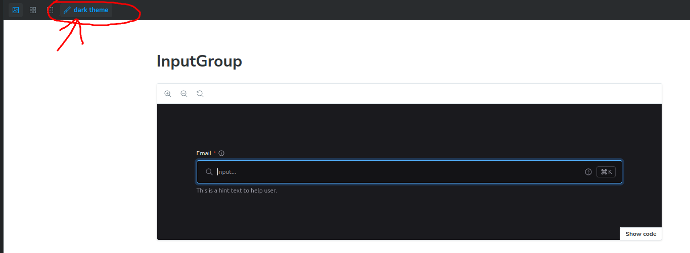

# Custom Input Component

This repository contains a reusable input component for React projects with TypeScript and Tailwind CSS.

## Features

- Developed using **React**, **TypeScript**, and **Tailwind CSS**.
- Modular components: `InputText`, `InputLabel`, `InputGroup`, and `InputAnnotation`.
- Can be used individually (`InputText`) or in combination for full functionality (`InputGroup`, `InputLabel`, `InputAnnotation`).
- Supports light and dark themes.
- Includes validation error handling with `InputAnnotation`.
- Optimized for integration with **ReactHookForm** through the use of `forwardRef`.

## Usage Example

Here's an example of how to use the component:

```tsx
import { InputText, InputLabel, InputGroup, InputAnnotation } from './path-to-component';

const MyComponent = () => (
  <InputGroup>
    <InputLabel>Label Text</InputLabel>
    <InputText />
    <InputAnnotation>Validation error message or help text</InputAnnotation>
  </InputGroup>
);
```

If you need to control the input using **ReactHookForm**, pass the `ref` attribute:

```tsx
<InputText ref={register} />
```

### Benefits of Using `forwardRef`

Using `forwardRef` allows this component to work seamlessly with libraries like **ReactHookForm**, enabling easy form state management, validation, and access to the underlying DOM element.

## Storybook Documentation

Explore all component variants and documentation with **Storybook**:  
[Component Overview](https://disrachik.github.io/custom-input/?path=/docs/components-ua-inputgroup--docs)

## Theme Support

This component supports both light and dark themes.

### Light Theme Example

<div align='center'>

</div>

### Dark Theme Example

In dark mode, the theme is controlled by Storybook, and you can switch between themes using the button shown below.

<div align='center'>

</div>
